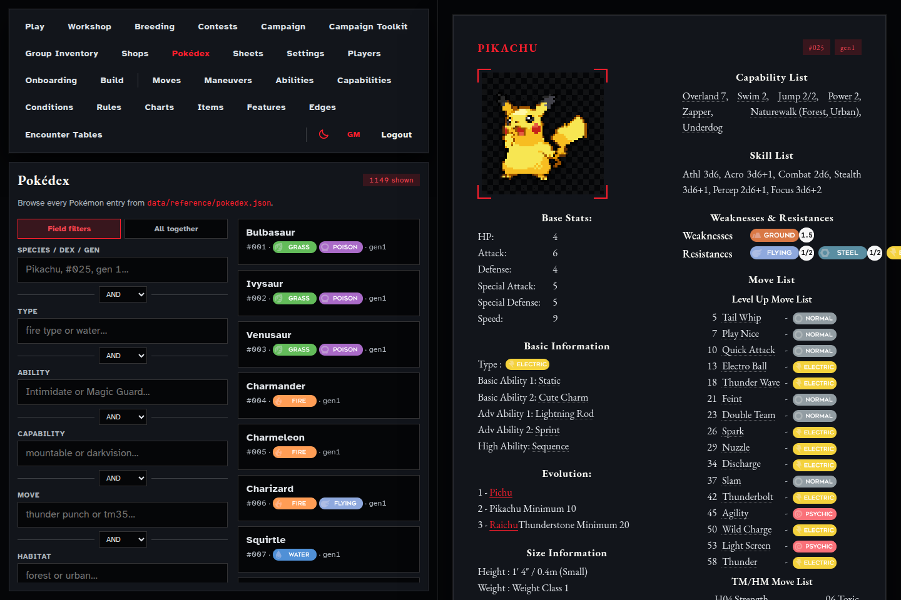
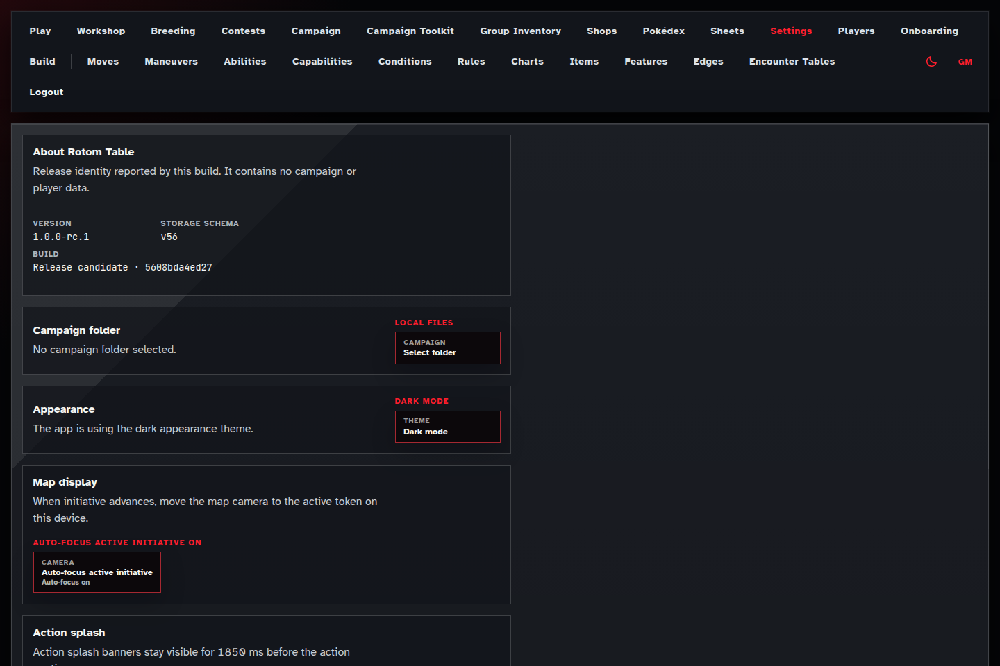

# Rotom Table

[](https://github.com/prodmodfour/rotom-table/actions/workflows/ci.yml)


Rotom Table is a core-complete, trusted-table liveplay companion for Pokémon Tabletop United campaigns. It combines a Three.js isometric table, server-authoritative encounters, Pokémon and Trainer sheets, campaign onboarding, breeding and Egg lifecycle, Contests, settlement and continuation, and a deterministic GM campaign toolkit in one Nuxt 4 application.

Rotom Table is a fan project. It is not official, endorsed, or a commercial Pokémon product. See [NOTICE.md](NOTICE.md) and the [fan-project notice](docs/fan-project-notice.md).

## Release identity

The current release is **1.0.1**, storage schema **v56**, verified locally only. It is the deterministic successor to the immutable, unpublished `v1.0.0` tag that failed exact checksum reproduction. Two clean tagged builds reproduced all 12,663 output checksums exactly (manifest SHA-256 `82fb0dfd…`) with zero artifact-audit findings. No gameplay, canonical PTU data, or campaign migration changed in this patch, and remote publication remains unauthorized.

A running private deployment reports the same package/build identity at:

- `/api/health`
- `/api/version`
- **Settings → About Rotom Table**

Version and upgrade policy: [docs/release/versioning.md](docs/release/versioning.md).

## Supported deployment

The 1.0 support boundary is deliberately narrow:

- private Linux x86-64 VPS;
- system-wide Node `>=24 <25`, npm, and `npm ci --include=dev` for source builds;
- built Nuxt/Nitro server managed by systemd and bound to loopback;
- a separate outer access gate for the known table group;
- Chromium desktop and mobile browser projects;
- SQLite campaign authority in private operator-controlled storage.

The GM/Player picker is a trusted-table role boundary, **not public authentication**. Do not expose Rotom Table as a public SaaS or arbitrary-internet service. Local hosting is not a supported liveplay deployment.

Start with the [private VPS hosting runbook](docs/private-vps-hosting.md), then use the [deployment checklist](docs/private-vps-deployment-smoke-checklist.md), [liveplay smoke checklist](docs/private-vps-live-play-smoke.md), and [backup/restore runbook](docs/private-vps-backups.md).

### Production shape

```bash
node --version
npm ci --include=dev
npm run build
sudo systemctl start rotom-table.service
curl -fsS http://127.0.0.1:3000/api/health
```

Production campaign writes require the reviewed private-host opt-in `ROTOM_ENABLE_HOSTED_WRITES=1`. The service must still remain behind the outer access gate.

## Product loop

Rotom Table has three connected product contexts:

- **Field Guide** — searchable Pokédex and app-owned Moves, Abilities, Capabilities, Edges, Features, Items, Conditions, Maneuvers, Rules, Contest, experience, and stat-ranking references.
- **Workshop** — campaign policy and character onboarding, sheet and inventory management, map preparation, breeding, Contests, encounter tables, deterministic wild/NPC packages, and session preparation.
- **Live Encounter** — role-projected map cockpit, command/revision/idempotency authority, Move/Ability/item mechanics, pending response windows, realtime recovery, settlement, and campaign continuation.

Runtime mechanics consume only the app-owned canonical authorities under `data/reference/` plus `shared/ruleset/natures.ts`. Documentary and provenance trees are never runtime fallback data.

## Current interface

[](docs/screenshots.md)

[](docs/screenshots.md)

See the [privacy-reviewed release screenshot set](docs/screenshots.md) for capture provenance and hashes.

## Campaign authority and recovery

SQLite is authoritative for maps, ordinary sheets, shared inventory, encounters, operations, onboarding, breeding, Contests, realtime durability, and GM Toolkit state. Residual campaign JSON is maintenance/export, profile, override, or private supporting material—not a silent runtime fallback for SQLite authority.

Supported release-boundary commands:

```bash
npm run migrate:sqlite -- --help       # documented JSON-era root → atomic v56 database
npm run upgrade:campaign -- --help     # app-produced SQLite v1-v56
npm run backup:campaign -- --help      # online or stopped-service private archive
npm run restore:campaign -- --help     # manifest/hash-verified fresh-root restore
npm run audit:campaign -- --help       # read-only aggregate integrity audit
```

Read the [upgrade guide](docs/release/upgrade.md) before moving an existing campaign. Database downgrade is unsupported; rollback means restoring the exact pre-upgrade backup.

## Development only

Development workflows are useful for contributors but are not the supported liveplay host:

```bash
nvm use
npm ci --include=dev
npm run dev
```

Use synthetic fixtures or a private campaign root outside the checkout:

```bash
ROTOM_CAMPAIGN_ROOT=../my-private-campaign npm run dev
```

Never commit campaign databases, WAL/SHM files, private profiles, environment files, backups, screenshots with campaign content, or generated release evidence. See [CONTRIBUTING.md](CONTRIBUTING.md), [SECURITY.md](SECURITY.md), and [campaign repositories](docs/campaign-repositories.md).

## Validation

Focused development checks are documented with each subsystem. The bounded repository gate is:

```bash
bash scripts/quality-gate.sh
```

Release-boundary checks are aggregated under:

```bash
npm run check:release-readiness
```

The workspace has finite memory; run broad TypeScript, Vitest, Nuxt, and build processes one at a time.

## Architecture

- `src/` — Nuxt pages, components, composables, styles, and browser presentation.
- `server/` — Nitro routes, server use cases, domain authority, and SQLite repositories.
- `shared/` — role-safe contracts and deterministic shared rules.
- `data/reference/` — the fourteen app-owned canonical JSON authorities.
- `data/` — reviewed mechanics registries, fixtures, and release certifications.
- `scripts/` — deterministic generators, drift checks, migration, backup, and release tooling.
- `tests/` — server, shared, component, integration, and production-liveplay acceptance.
- `docs/` — operator, GM, player, contributor, architecture, and historical material.

See [docs/README.md](docs/README.md), [architecture](docs/architecture.md), [liveplay authority](docs/live-play-authority.md), [ADR 009](docs/adrs/009-server-authoritative-profile-play.md), and [the GM Campaign Toolkit index](docs/gm-campaign-toolkit/README.md).

## Key routes

| Route | Audience and purpose |
| --- | --- |
| `/login` | Trusted-table GM or Player/profile selection |
| `/maps` and `/maps/:slug` | Map library, Workshop, and Live Encounter |
| `/sheets` | Ordinary Pokémon and Trainer sheets |
| `/onboarding` | Guided campaign character onboarding |
| `/breeding` | Breeding and Egg lifecycle Workshop |
| `/contests` | Contest preparation and runtime |
| `/encounter-tables` | GM campaign tables and deterministic generation |
| `/session-prep` | GM preparation and immutable Builder launch |
| `/group-inventory`, `/shops`, `/players` | Campaign inventory, commerce, and profile custody |
| `/pokedex` and reference routes | Field Guide |
| `/settings` | GM settings and release identity |

## Support boundary

Rotom Table is maintained as a best-effort hobby/private-table project. Security reports must be sent privately as described in [SECURITY.md](SECURITY.md). There is no response-time SLA, uptime guarantee, hosted service, paid support, data-recovery service, or compatibility promise outside the machine-readable [supported platform matrix](data/release-readiness/supported-platform-matrix.v1.json). See [support expectations](docs/support.md).

## License and third-party material

The repository license is scoped in [LICENSE](LICENSE). Pokémon/PTU names, rules material, sprites, media, and other third-party content are outside that grant and remain with their respective owners. Attribution and fan-content posture are described in [NOTICE.md](NOTICE.md).
