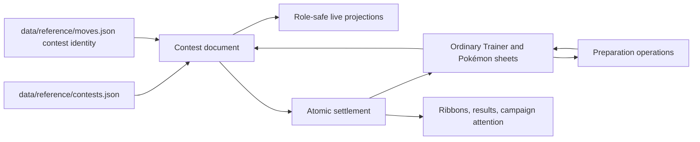

# Pokémon Contests

Rotom Table runs Pokémon Contests as ordinary liveplay campaign activity. Contest preparation changes ordinary Trainer and Pokémon sheets; a running Contest is one revisioned server document; settlement writes experience, ribbons, prizes, and history back to ordinary sheets in one transaction.

## Guides

- [Player and GM guide](player-and-gm-guide.md) — preparation, setup, variants, play, interventions, and settlement.
- [Architecture and API](architecture-and-api.md) — document boundary, commands, projections, realtime, and persistence.
- [Canonical-data maintenance](canonical-data-maintenance.md) — reviewed migration and coverage checks.
- [Operations and recovery](operations-recovery.md) — liveplay hosting, restart, exact retry, backup, and troubleshooting.
- [Accessibility and acceptance](accessibility-and-acceptance.md) — keyboard, touch, screen reader, reflow, privacy, and validation evidence.

## Authority in one diagram

Documentary books, parser inputs, PDFs, and websites are provenance only. Runtime modules consume app-owned `data/reference/*.json` files.

## Alpha acceptance

`data/contests/alpha-acceptance.v1.json` is the machine-readable P10-100 closure record. It binds the reviewed catalog, deterministic fixtures, authority/runtime implementation, browser journey, guides, and repository validation status. Candidate status permits only the final quality-gate rerun and archival to remain; accepted status requires all 100 tickets complete, the plan archived, every validation passed, zero blocked canonical rows, and zero critical Contest debt.