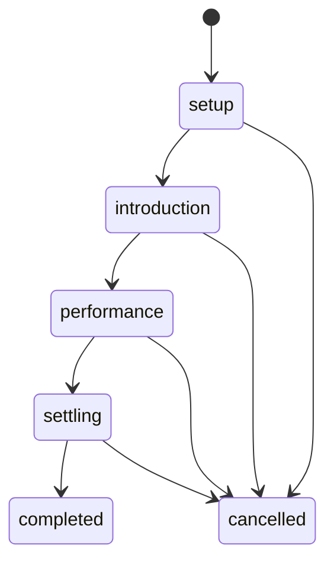

# Pokémon Contest architecture and API

## Boundaries

Canonical runtime inputs are `data/reference/contests.json`, `data/reference/moves.json#contest`, and existing app-owned Feature/Edge/Ability/item catalogs. `shared/contests/catalog.ts` fails closed on catalog drift.

`ContestDocumentV1` (`shared/contests/document.ts`) pins `catalogId`, schema version, revision, lifecycle, enrollment snapshots, preparation pools, dice journals, appeal ledger, pending effects, corrections, history, and settlement. Ordinary sheets stay the durable preparation/reward authority.

SQLite migration 46 creates:

- `contests`;
- `contest_operations`;
- `contest_preparation_operations`;
- `contest_ux_metric_aggregates`.

## Lifecycle

Every mutation has `schemaVersion`, stable operation ID, expected revision, contest ID, command kind, and optional client ID. Exact retries return the stored result; operation-ID payload changes fail.

Commands are declared in `shared/contests/operations.ts`; read/write/atomicity ownership is in `shared/contests/architecture.ts`. Mutation APIs:

- `POST /api/contests/command`
- `POST /api/contests/preparation`
- `POST /api/contests/metrics` (bounded aggregate-only UX samples)

Reads:

- `GET /api/contests/list`
- `GET /api/contests/:contestId`

The server rejects unknown fields, stale revisions, forged options, wrong turns, pool overspend, illegal repeats, unsupported variants, invalid prize targets, and out-of-window interventions with stable `contest.*` codes.

## Randomness and evidence

Production uses Node cryptographic integer randomness. Introduction, bonus, tie, appeal, reroll, Supercontest, and placement rolls append immutable journal entries. Sequence/seed random sources are fixture-only. A reroll references replaced evidence rather than deleting it.

## Projections and privacy

The server independently constructs public, owner, GM, and diagnostic projections:

- public: stage, letters, positions, scoreboard, accepted appeals, public history, declared prize, settlement;
- owner: public plus exactly one controlled contestant’s offers, pools, providers, and pending decision;
- GM: all contestants, policy, notes, and corrections;
- diagnostic: GM plus raw journal and contributor index after explicit GM query.

The browser never receives an authoritative document and redacts it. Realtime events are role-targeted refresh signals; clients refetch the correct structural projection.

## Settlement

`prepare-settlement` snapshots deterministic placements, experience, ribbon, money, and items. `commit-settlement` and all Trainer/Pokémon writes share one SQLite transaction. Realtime sheet updates are persisted in the same transaction and published after commit. Publication failure cannot roll back committed authority; reconnect replay converges.

## Extension rules

1. Add canonical identities through the reviewed migration, never runtime prose.
2. Add a stable command/option identity and bounded parser.
3. Declare read/write sets.
4. Resolve in the engine without client scoring.
5. Add role-projection and realtime tests.
6. Add exact retry, rollback, fixture, UI, accessibility, and documentation evidence.