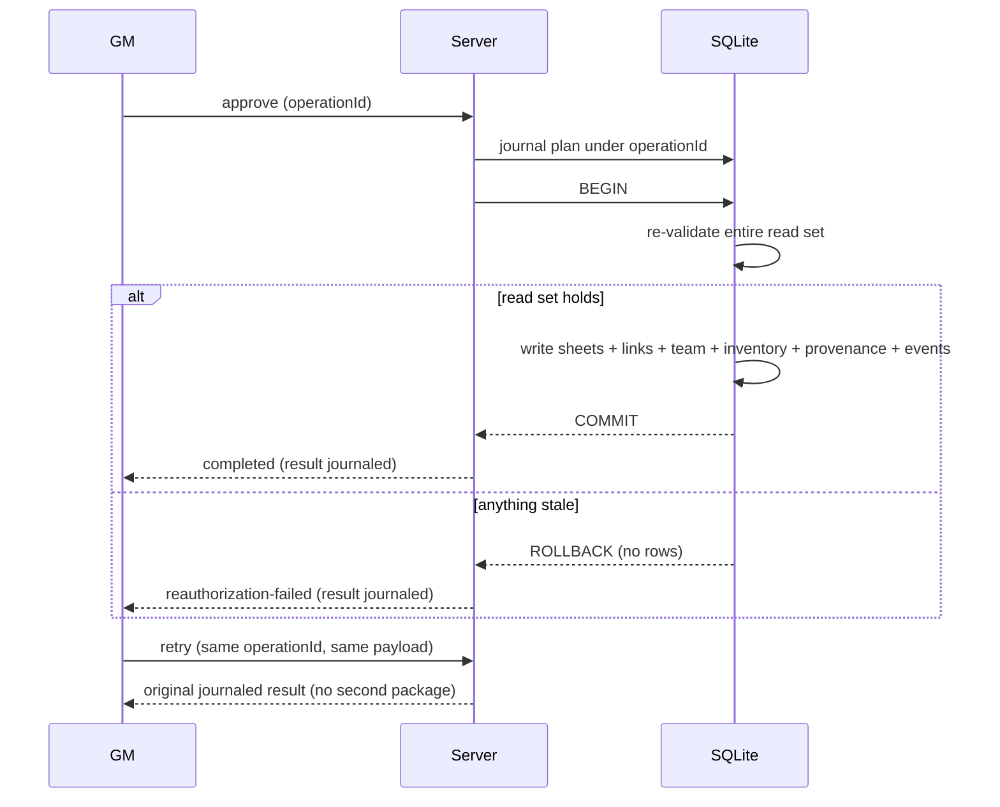

# Onboarding read sets, write sets, and atomicity

- Contract: `shared/onboarding/commitPlan.ts` (`OnboardingCommitPlanV1`)
- Date: 2026-08-16
- Plan: P9-018

## Principle

Final approval either creates and links the **entire** character package or changes **nothing** (product rules 10–11). The commit consumes an explicit plan: a read set the transaction re-validates and a write set it applies. The same plan object is the GM's approval preview (P9-056), so what the GM sees is literally what will be written.

## Operation read/write sets

| Operation | Reads | Writes |
| --- | --- | --- |
| Draft mutation | draft revision, slot binding, policy version, catalog fingerprint | draft document (revision+1), owner realtime event |
| Submission | full draft, policy content, catalog, profile binding | submission snapshot (immutable), draft state, owner+GM events |
| Change request / correction | submission revision, draft state | review thread entry, draft state, owner event |
| Approval planning | submission snapshot, policy, catalog, slug availability, folder list, profile existence | nothing (plan is computed, journaled with its operation ID) |
| **Final commit** | plan read set (below) | plan write set (below) in one SQLite transaction |

### Commit read set (`OnboardingCommitReadSetV1`)

- `draft` — draft ID + exact revision the plan was computed from; any later draft write invalidates the plan.
- `policy` — immutable policy identity (ID, version, content hash).
- `catalogFingerprint` — canonical catalog identity for final re-authorization.
- `profileId` + `slotId` — the profile must exist and still be bound to the slot.
- `slugReservations` — every planned slug must still be free inside the transaction.
- `folderDestinations` — folders created if absent (idempotent).

### Commit write set (`OnboardingCommitWriteSetV1`)

- `sheets` — one trainer + N pokemon documents (ordinary runtime sheets, no onboarding-only fields).
- `profileLinks` — every created sheet linked to the owning profile.
- `team` — trainer `currentTeam`/`boxedPokemon` covering every created pokemon exactly once.
- `startingMoney`, `inventoryRows`, `starterHeldItems` — policy package application with canonical item identities.
- `completionRecordId` — provenance record binding slot, policy version, submission revision, and created refs.
- `realtimeEventTypes` — completion events appended in-transaction, published after commit.

`assertOnboardingCommitPlanConsistency` rejects internally incoherent plans before anything runs: unplanned team refs, unlinked sheets, missing reservations, duplicate slugs, cross-profile links, or inventory rows targeting a different trainer.

## Atomicity and retry

- The plan is journaled under its stable `operationId` **before** the transaction; retry after crash consults the journal (`classifyOnboardingIdempotentRetry`): same payload → stored result; different payload → conflict.
- Profile linking currently lives in filesystem JSON (see the P9-002 authority inventory). The commit therefore orders: SQLite transaction first (sheets, team, inventory, provenance, completion journal), then profile-link application with verification and compensation; the completion record stores link state so reconciliation is deterministic. Phase 3 storage work (P9-021+) keeps all *new* onboarding state in SQLite; if profile storage migrates to SQLite later, links join the same transaction with no contract change.
- Realtime events append in-transaction and publish after commit, matching the platform's library-mutation pattern.
