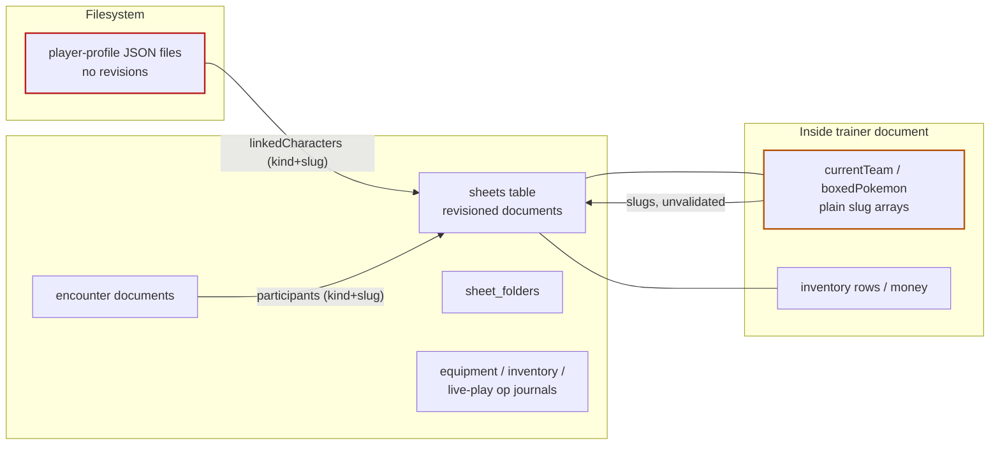

# Onboarding authority inventory

- Inventory: `onboarding-authority-baseline-v1`
- Baseline commit: `ec672287`
- Date: 2026-08-16
- Structured source: [`data/onboarding/authority-inventory.json`](../../data/onboarding/authority-inventory.json)
- Plan: P9-002

## Purpose

This inventory maps every create, save, rename, folder, profile-link, team, equipment, inventory, and encounter-participant operation that the zero-to-play journey currently touches, and classifies the authority risks the onboarding plan must respect or close: dual authority, client-owned mutation, unstable identity, missing revision checks, and operations that can leave profiles or teams pointing at incomplete or nonexistent sheets.

## Authority map

## Key findings

1. **Profiles are filesystem JSON; sheets are SQLite.** There is no transaction that can atomically create sheets *and* link them to a profile today. `updatePlayerProfile` is a whole-file overwrite with no revision check (last write wins). Onboarding's atomic commit (P9-057) must either bring profile links into the same SQLite transaction boundary or define an explicit two-phase order with reconciliation.
2. **Sheet identity is the slug, and only maps follow renames.** `sheetRepository.rename` retargets map token references atomically but leaves trainer `currentTeam`/`boxedPokemon` and profile `linkedCharacters` dangling. Deletion behaves the same. Any onboarding-created link graph must be rename/delete safe or renames must be blocked while referenced (P9-067).
3. **Team membership is client-owned.** Team arrays travel inside the whole-document sheet save. The server never checks existence, uniqueness across trainers, or profile consistency. Live play discovers failures later as missing control.
4. **Whole-document save is the only creation writer.** Everything a character *is* (stats, skills, features, money) is accepted verbatim from the client under a document CAS. Derived legality is display math in `src/utils/sheets/*`, not server validation. Onboarding must add authoritative validation without forking the sheet format (product rule 1).
5. **Plan 8 op-journal patterns are the model.** Equipment and inventory operations already demonstrate the target shape: stable operation IDs, read-set revision checks, exact retry, durable realtime. Draft mutations, submission, and the final commit must follow that shape rather than the whole-file profile pattern.
6. **Folder placement is an implicit visibility rule.** `isRuntimePlayerFolderPath(folder)` marks created sheets player-accessible. Onboarding folder destinations (policy-owned) must account for this so committed sheets get correct visibility without manual folder fixes.

## Operations

See the structured JSON for the full table. Summary:

| Operation | Storage | Revision control | Main risk |
| --- | --- | --- | --- |
| Sheet create | SQLite | new doc | sound |
| Sheet save (setup) | SQLite | `expectedRevision` CAS | client-owned creation fields |
| Sheet rename | SQLite | CAS | team/profile links dangle |
| Sheet delete | SQLite | row presence | team/profile links dangle |
| Sheet folders | SQLite | transactional | implicit player visibility |
| Profile create | FS JSON | exclusive create | dual authority with SQLite |
| Profile update/links | FS JSON | **none** | lost updates, stale links |
| Team membership | trainer doc | trainer CAS only | unvalidated slug arrays |
| Equipment ops | SQLite | op IDs + read sets | sound (reuse) |
| Inventory actions | SQLite | op journal | coexists with raw row edits |
| Encounter participants | SQLite | doc revisions + op IDs | raw sheet candidates |

## Consequences for the plan

- P9-018 (read/write sets and atomicity) must treat player-profile linking as a first-class write with an explicit consistency strategy, because profile storage currently cannot participate in the SQLite transaction.
- P9-021+ (onboarding storage) must be SQLite with revisions and operation journals from day one; nothing new may adopt the filesystem-profile pattern.
- P9-057 (atomic package commit) is responsible for the sheets+team+links+inventory+equipment+provenance write set; the audit shows the only current cross-resource atomicity precedent is rename→map retargeting and the Plan 8 op journals.
- P9-067 must handle rename/delete conflicts for adopted characters since the platform does not.
