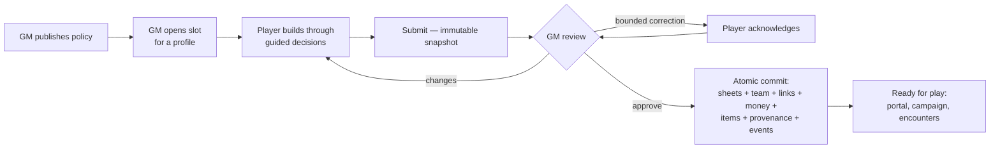

# Guided character creation and campaign onboarding

- Plan: `implementation-plans/done/CHARACTER_CREATION_AND_CAMPAIGN_ONBOARDING_PLAN.md`
- Audience: players, GMs, contributors, operators (alpha product documentation; P9-099)

## What onboarding produces

Onboarding takes a trusted-table participant from an empty player profile to a **rules-valid, GM-approved, profile-linked Trainer and starter team** that can immediately enter the play loop. The result is ordinary sheet authority: after approval the draft is archived provenance and the created sheets are the only mechanical truth.

## For players

1. **Resume anywhere.** `/onboarding` shows your slot; the draft is durable and server-owned — reload, switch devices, or come back tomorrow and you continue at the same decision.
2. **The builder** (`/onboarding/draft/…`) walks one decision at a time: identity → stat points → background → Training Feature → Edges → Features & classes → (milestones for higher-level starts) → each starter's species, nature/identity, ability, moves, stat points → review. The right rail previews HP, AP, stats, and budgets with their contributors; the left rail shows progress and jumps anywhere.
3. **Validation explains itself.** Blocking issues name the decision that fixes them; "Fix →" links land you on it. You cannot submit while anything blocks; deferrable optional decisions (when the campaign allows them) become follow-ups after completion.
4. **Submission freezes a snapshot.** The GM reviews exactly what you submitted. If they request changes you'll see the reasons and comment in Review history; resolve and resubmit. If they apply a bounded correction (for example a rename), you see before/after and the rationale, and approval may wait for your acknowledgement.
5. **Ready for play.** After approval your Trainer and starters are linked to your profile automatically — the Trainer portal, Campaign page, and encounters see them with no manual steps.

## For GMs

- **Policy first** (`/onboarding/policy`). Starting level, money, starter count/level/pool, stage restriction, Loyalty, ball policy, item packages (with reviewed presets), deferral policy, and sheet folders are one immutable versioned document. Publishing creates a new version; existing drafts stay pinned to theirs until you migrate (previewed) or restart them from the queue.
- **Slots** (`/onboarding`). Open a slot for an existing profile or create profile+slot together. The queue shows state, age, submission count, and next action. Cancel and restart are journaled operations with exact retry.
- **Review** (`Review` on a submitted row). One workspace shows the trainer facts, every starter, validation (re-authorized against current canonical data), reviewed-clause deviations needing your confirmation, and *exactly* what approval will write (sheets, links, team, money, items, provenance). Request changes with stable reasons plus optional comment and a GM-only note (structurally invisible to players). Apply bounded corrections (rename Trainer/starter, revise concept text) — receipt-backed, validator-checked, optionally acknowledgement-gated.
- **Approval** either creates the whole package atomically or nothing; exact retry of the same operation returns the original result and reconciles profile links if the first attempt was interrupted.
- **Existing characters** (`/onboarding/intake`). Adopt a veteran Trainer: discovery, findings classified as blocking-structural / repairable-legacy / ownership-conflict / policy-deviation / informational, bounded roster repairs (dangling refs, duplicates, overflow), explicit cross-profile conflict resolution, and provenance recording. History — money, injuries, XP, inventory, resources — is never rewritten.
- **Into the encounter.** "Send a party to an encounter" places a completed package onto a staging battlefield side in one authorized step (a live scene uses the ordinary in-play tools). The Encounter Builder lists onboarded parties with owner and readiness state.
- **Direct blank-sheet creation stays available** in the Sheets library as an advanced GM workflow for NPCs, tests, and unusual cases; it is no longer the normal new-player path.

## Reopen policy (P9-078)

Completed, cancelled, and superseded drafts are terminal. They never again become authority: content saves, submissions, and corrections are refused, and lifecycle transitions out of terminal states are illegal. Post-completion changes belong to ordinary sheet editing and progression workflows; when a character should be rebuilt, the GM opens a *new* slot (restart supersedes with audit history retained).

## For contributors

- **Contracts** live in `shared/onboarding/`: ids, policy, draft, lifecycle, catalog, validation, validate (engine), preview, decisions, commitPlan, realtime, presets. The same validation engine runs in the builder, at submission, and inside approval re-authorization; the drift gates (`tests/shared/onboardingContractGates.test.ts`) fail when client and server maths disagree or canonical coverage regresses.
- **Canonical authority** is only `data/reference/*.json` plus the automation catalogs. The `Character Creation` rule in `rules.json` carries `characterCreationMechanics` (background composition, starting money baseline, starting Loyalty) with documentary source hashes; runtime never parses prose.
- **Storage** is SQLite migration v45: policies, slots, drafts, submissions, review entries, operation journal, completions. Every terminal operation is journaled (`onboarding_ops`) with payload hashes for exact retry.
- **Coverage closure**: `data/onboarding/creation-rule-coverage.json` binds every inventoried creation decision to a rubric state, evidence, and tests; its certifier forbids blocked rows and orphan coverage.

## For operators

- **Backup** is the ordinary byte-for-byte SQLite backup; drafts, submissions, operations, policies, and completions restore exactly (`tests/server/onboardingBackupAndVariants.test.ts`). Player profiles remain campaign-root JSON files; approval applies profile links after the SQLite commit and records `profileLinksApplied` in the completion so interrupted link application reconciles on retry.
- **Restart safety**: drafts and review state are durable rows; reconnect resumes the exact decision. Uncertain approvals are resolved by retrying the same operation ID — the journal returns the terminal result and never creates a second package.
- **Privacy**: player access requires the owning selected profile; unrelated principals receive plain 404s; GM-only notes live in a separate audience lane; onboarding metrics are aggregate-only by contract (`data/onboarding/ux-success-criteria.json`).

## Troubleshooting

| Symptom | Meaning | Action |
| --- | --- | --- |
| "Out of date" in the builder | Another tab/device saved a newer revision | Reload latest; unsent intent is retyped, never silently merged |
| "Save failed" | Network/authorization failure | Check the connection and selected profile, retry; content stays local until saved |
| Submit blocked with N issues | Server re-validation found blockers | Open Review; every issue links to its decision |
| Approve disabled with deviations | Reviewed-clause prerequisites need explicit confirmation | Tick the confirmation after judging them |
| Approve blocked by acknowledgement | A correction requires the player's acknowledgement | Player acknowledges in Review history |
| Party join says the scene is live | Whole-map placement is setup-only by design | Use in-play send-out tools, or switch the map to setup mode |
