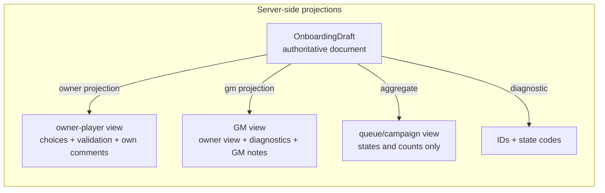

# Onboarding roles, privacy, and trust boundaries

- Contract: `onboarding-roles-privacy-v1`
- Date: 2026-08-16
- Structured source: [`data/onboarding/roles-privacy-contract.json`](../../data/onboarding/roles-privacy-contract.json)
- Plan: P9-006

## Roles

| Role | Definition |
| --- | --- |
| `gm` | The table's GM role cookie. Owns policy, slots, review, corrections, and final authority. |
| `owner-player` | Player role whose **selected profile** matches the slot's bound profile. The only role that can author the draft. |
| `other-player` | Player role with a different selected profile. Sees table-level aggregates only. |
| `public-observer` | Unauthenticated or roleless access. Sees nothing of onboarding. |
| `diagnostic-operator` | Operational inspection (server logs, health surfaces). Sees stable IDs, states, and codes — never choice values or comments. |

The identity boundary is unchanged from the trusted-table model: shared table password, role cookie, GM-created player profiles (`shared/auth.ts`, `shared/playerProfiles.ts`). Onboarding introduces **no** accounts, invitations, passwords, or reusable secret links. A slot is authorization by *profile binding*, not by token possession.

## Access matrix

See the structured contract for the full per-resource matrix. Load-bearing rules:

1. **Structural privacy.** Every projection is computed server-side. `other-player` receives *no* draft resource at all — not a redacted one. GM-only notes live in a lane that owner serialization never touches (product rule 14).
2. **Ownership is server-validated per mutation.** The client's remembered profile selection is a convenience; each draft read/write re-checks that the requesting role is GM or that the selected profile is the slot's bound profile (P9-025).
3. **Corrections are visible.** Any GM write into a player's draft is a bounded, receipt-backed correction the owner can always read (and, where required, must acknowledge) — never a silent edit (P9-055).
4. **Diagnostics are shape-only.** Draft enumeration, payload sizes, state codes, and operation IDs. No choice values, no comments, no fictional identity.
5. **Metrics are aggregate-only.** No campaign identities, character names, private choices, comments, or draft payloads (P9-008).
6. **After commit, ordinary authority takes over.** Completed sheets follow existing sheet/profile/team visibility rules; the archived onboarding record exposes provenance to GM and owner only.

## Threats considered (trusted-table scope)

| Threat | Mitigation |
| --- | --- |
| Player A reads player B's draft by ID probing | Draft access requires GM role or owning profile; enumeration returns owner-scoped lists only (P9-088 tests). |
| Player rebinds a slot to their own profile | Slot binding is GM-only; binding changes are recorded operations. |
| Client downgrades a blocking issue | Severity lives server-side; submit/approve re-validate on the server regardless of client state (product rule 7). |
| Forged policy/choice IDs in a draft payload | Every ID re-authorizes against the bound policy version and canonical catalog at save, submit, and approval (product rule 6). |
| Stale client overwrites newer draft | Revision-checked mutations; stale writes conflict and reconcile (P9-013). |
| GM note leakage into player view | GM notes are structurally separate; serialization tests assert absence (P9-093). |
