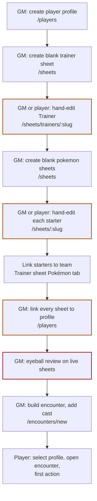

# Zero-to-first-encounter journey audit

- Inventory: `onboarding-zero-to-play-baseline-v1`
- Baseline commit: `ec672287`
- Date: 2026-08-16
- Structured source: [`data/onboarding/zero-to-first-encounter-task-inventory.json`](../../data/onboarding/zero-to-first-encounter-task-inventory.json)
- Plan: [Guided Character Creation and Campaign Onboarding](../../implementation-plans/done/CHARACTER_CREATION_AND_CAMPAIGN_ONBOARDING_PLAN.md) (P9-001)

## Purpose

This audit freezes what a GM and a player must currently do to go from an empty player profile to a Trainer with a starter team taking its first legal encounter action. It records every manual construction step, duplicate entry, hidden prerequisite, invalid-state escape, and direct storage repair, with owning code paths and the future plan tickets that replace each gap.

It is a baseline, not a design. Target behavior lives in the plan tickets referenced by each task.

## The current journey

Ten distinct surfaces are involved (`/login`, `/players`, `/sheets`, trainer editor, pokemon editor ×N, trainer Pokémon tab, `/players` again, both sheets again for review, `/encounters/new`, `/play/:encounterId`), and the GM owns eight of them. The player can only edit sheets after the GM has created and (for private sheets) linked them.

## Main findings

### Manual construction dominates

Creating a character *is* editing a blank sheet. Every creation decision — stats, background, skills, Training Feature, Edges, Features, classes, money, inventory, species, level, added stats, Abilities, Moves — is ordinary field editing with no notion of a required decision sequence, remaining budget gates, or completion. The `remainingFeatures` / `remainingEdges` counters and stat budgets are user-maintained display fields, not authority.

### Campaign policy is table knowledge

Starting level, stat budget, starter species pool, starter count, starting money, and standard kit exist nowhere in the app. Two campaigns with different house rules are indistinguishable at runtime; the GM enforces policy by memory during eyeball review.

### Review has no authority

There is no submission, snapshot, change request, correction record, or approval. The GM reviews live, mutable documents; the player can edit mid-review; "approved" is a verbal event. Corrections are silent direct edits, indistinguishable from any other sheet change.

### Linking is duplicated and fragile

The same characters are selected twice (team linking on the trainer sheet, profile linking on `/players`). Team membership is a plain slug array; profile links are validated for existence at link time only. Forgetting one pokemon link silently removes player control of that starter in live play — the failure surfaces minutes later as a token that will not respond, with no diagnostic pointing back at the missing link.

### Blank sheets are indistinguishable from ready characters

A freshly created empty sheet is immediately a full library citizen: linkable, teamable, placeable in encounters. Nothing distinguishes "mechanically empty shell" from "reviewed, ready character" anywhere in the library, Builder, or campaign surfaces.

### Existing-character adoption is unaudited

Adopting a pre-existing or imported character is the same manual linking flow with zero validation. Structural repair of legacy sheets means editing live documents or JSON exports by hand (`server/storage/importSheetsFromJson.ts` is the only bulk path), with no preview, bounds, or history.

## What already works and must be reused

- **Trusted-table access**: shared password plus role cookie (`shared/auth.ts`), GM-only writes (`requireGm`), selected player profile as the player identity. Onboarding must not invent accounts or invitations (P9-006).
- **Server-authoritative revisioned sheets**: SQLite documents with revisions, folders, realtime library events, exact-retry patterns on live-play operations.
- **Player profiles**: `shared/playerProfiles.ts` linked-character refs with existence validation and campaign-attention invalidation.
- **Canonical reference data**: `data/reference/*.json` already backs sheet pickers, automation instances, and derived math.
- **Derived sheet logic**: trainer/pokemon derivations (`src/utils/sheets/*`) already compute budgets, HP, skills, and legality *displays* — the missing part is authoritative validation, not the math.
- **Downstream play loop**: encounter documents, token control, live-play commands, settlement, campaign continuation are complete (Plans 1–8) and are the hand-off target, not rework.

## Invalid-state escapes to close

| Escape | Where it leaks | Closing tickets |
| --- | --- | --- |
| Illegal stat totals save silently | Trainer/Pokémon stat panels | P9-033, P9-043 |
| Missing Training Feature at play | Trainer editor | P9-035 |
| Prerequisite-violating Edges/Features/classes | Trainer editor pickers | P9-036, P9-037 |
| Starter species outside campaign pool | Pokémon identity panel | P9-041 |
| Illegal Abilities/Moves/zero-move starters | Pokémon panels | P9-044, P9-045 |
| Dangling/duplicated team slugs | Trainer Pokémon tab | P9-048, P9-057 |
| Team/profile link inconsistency | `/players` | P9-057, P9-066 |
| Mid-review edits change the review target | Sheet editors | P9-052 |
| Blank sheets enter encounters | Encounter Builder | P9-075 |
| Unvalidated legacy adoption | Manual linking/import | P9-062–P9-070 |

## Direct storage repairs to eliminate

- Hand-editing sheet JSON exports and re-importing (`server/storage/importSheetsFromJson.ts`) to fix malformed legacy documents → replaced by bounded intake repairs (P9-065).
- Direct live-document edits to correct another player's build during review → replaced by explicit GM corrections with receipts (P9-055).
- Manual `remainingFeatures`/`remainingEdges` bookkeeping → replaced by authoritative budget validation (P9-036).

## Task inventory

The structured inventory records 21 tasks across the journey stages `access`, `profile-identity`, `trainer-build`, `pokemon-build`, `team-linking`, `profile-linking`, `review-approval`, `campaign-visibility`, `encounter-entry`, `first-action`, and `existing-adoption`. Each task carries owning code paths, current flow, authority inputs, classified findings, a baseline status, and the future tickets that own its replacement. See the JSON source; `tests/data/onboardingZeroToFirstEncounterInventory.test.ts` keeps it structurally sound and its owners/tickets real.
