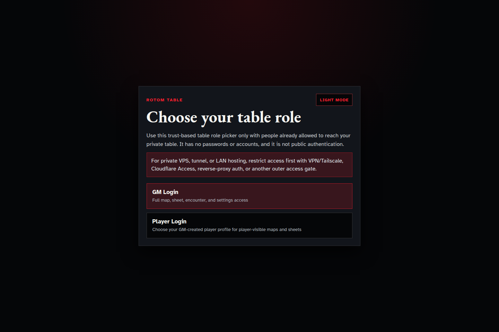

# Release screenshot set

The repository presentation uses the following privacy-reviewed Rotom Table 1.0 candidate screenshots. They were captured from a production Nuxt/Nitro build at `1.0.0-rc.1`, storage schema v56, in Chromium at 1440 × 960 CSS pixels.

No real campaign, player, operator, hostname, secret, network address, or filesystem path appears in these images. The capture used a fresh synthetic campaign root. The Pokédex view contains only shipped app-owned reference presentation and the repository’s existing Pikachu profile sprite.

## Trusted-table role boundary

SHA-256: `3440b686f43b9bf3e4cb09ba71fef1bc30cc798e94fee303b322f828db839d3e`

This is the first-run boundary: it states that the role picker is not public authentication and requires an outer access gate.

## Field Guide

SHA-256: `a943d2688b4746c19f7d95fb1c4878ecefd7a8754faef8bb303c5041e274ceaf`

This captures the canonical `data/reference/pokedex.json` browser and detail projection without campaign content.

## Release identity

SHA-256: `c6ac7ba34e9923d07565d49d7d7d02853b6a66a25ac87d2c26bc5c6797469516`

This captures the Settings identity projection used by operators to compare UI, `/api/version`, `/api/health`, and package/build provenance.

## Capture record

- Captured: `2026-08-27T13:36:49Z`
- Browser viewport: 1440 × 960
- Source: production build from commit `5608bda4ed2717f729f1300406d8b60c870499d6`
- Build identity: `1.0.0-rc.1`, schema v56
- Campaign input: fresh synthetic root under `/tmp`; deleted after capture
- Privacy review: no private table data present

Refresh screenshots only from a clean synthetic fixture. Recompute the hashes in this file and update any bound release certification whenever pixels change.
